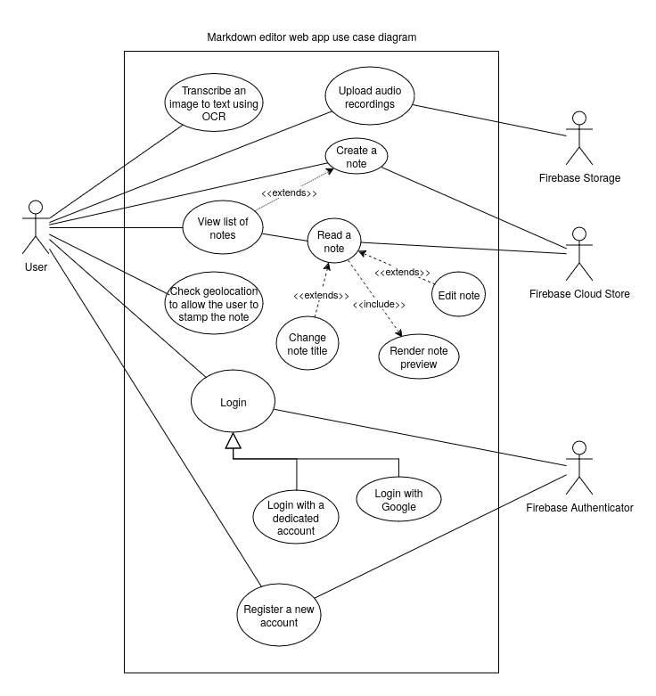

# Markdown Web Editor

This project is a simple web-based markdown editor that allows you to write and preview markdown in real-time.

## Features

- Write markdown in the editor
- Preview markdown in real-time
- Save your notes in the cloud
- Extract text from images using OCR
- Create audio recordings in the background

The app is **installable as a PWA**.

## Use case diagram



## Prototype

### Interactive

The prototype for this project can be found
[here](https://design.penpot.app/#/view/68a1c0e6-b27c-807b-8004-4d7c57bc765a?page-id=20f2ebdc-f103-8067-8004-4d9c7649fd0a&section=interactions&frame-id=20f2ebdc-f103-8067-8004-4d9c7a38c84e&index=0&share-id=68a1c0e6-b27c-807b-8004-4da31ea9e1c6)
and was created using [Penpot](https://penpot.app/).

### Static images

You can view the static images of the prototype in the `docs/prototype` directory. Here are some examples:

## Contributing

### Project Setup

```sh
npm install
```

#### Compile and Hot-Reload for Development

```sh
npm run dev
```

#### Compile and Minify for Production

```sh
npm run build
```

#### Lint with [ESLint](https://eslint.org/)

```sh
npm run lint
```
